# 手摸手教你搭建FasfDFS分布式文件系统

由于正在学习的分布式项目中用到了`FastDFS`文件系统，因为各种原因就只好手动搭建环境。搭建过程确实很复杂，我也是折腾了好长时间才解决的，看了网上的教程，但很少有直接就能搭建成功得博文教程，所以这里自己写了一个完成的教程，并附带了所需的配置文件。

需要注意的是Linux系统、版本的问题，我这里使用的是CentOS7的版本，如果大家搭建请尽量保证版本一致。

<!--more-->

## 起步

```
1、下载Linux系统（以CentOS为例）
  [CentOS7-Minimal](http://isoredirect.centos.org/centos/7/isos/x86_64/CentOS-7-x86_64-Minimal-1804.iso)
  
2、安装SecureCRT
  因为实际的服务器并不存在桌面，所以我们安装Minimal版本的CentOS即可，但是在CentOS的黑窗口中操作并不方便，所以下载SecureCRT操纵服务器。
```

<br/>

### 安装CentOS

本例中用VMware安装的CentOS系统，在安装时需要注意一个问题：

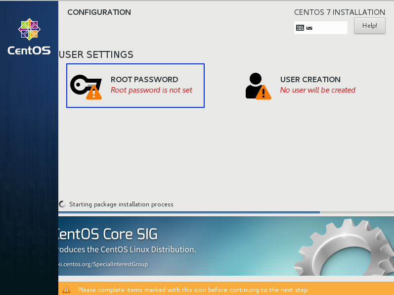

如上图所示，在安装CentOS时不要创建新用户，设置个ROOT密码即可，这样登录进去系统后默认就是ROOT权限，避免了权限不够的问题。（登录用户名密码默认都是`root`）

**1、登录系统并配置连接网络**

输入命令：`cd /etc/sysconfig/network-scripts/ && ls`，编辑列表中的第一个文件（因为文件名称可能不相同）

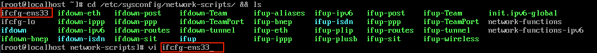

将最后行的`no`改成`yes`即可

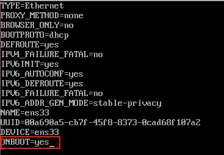

修改点击键盘的`i`键进入编辑模式，修改完成后按下ESC键，再输入`:wq!`保存退出即可；然后执行命令`service network restart`重启服务。

此时已经完成了CentOS的联网，输入命令`ip addr`查看服务器的IP地址（如果联网成功，会出现192.168.xx.xx类似这样的IP地址）：

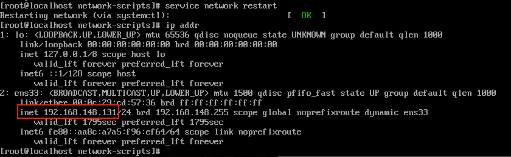

这个IP地址即使此服务器的外网IP，即我们要用SecureCRT连接的服务器的IP

**2、使用SecureCRT连接服务器**

SecureCRT的使用方法不在说了，就是简单的创建一个连接，输入服务器的IP地址、账户、密码即可完成连接。

**3、关闭CentOS7的防火墙**

作为我们测试用的本地服务器，加一个防火墙实在是没有必要的，所以索性关闭防火墙。
输入命令：
```
systemctl stop firewalld.service #停止firewall
systemctl disable firewalld.service #禁止firewall开机启动
firewall-cmd --state #查看默认防火墙状态（关闭后显示notrunning，开启后显示running）
```

<br/>

## 环境准备

### 安装所需命令

```
[root@localhost ~]# yum install make cmake gcc gcc-c++ 
[root@localhost ~]# yum install vim-enhanced
[root@localhost ~]# yum install zip unzip
[root@localhost ~]# yum install -y pcre pcre-devel
[root@localhost ~]# yum install -y zlib zlib-devel
[root@localhost ~]# yum install -y openssl openssl-devel
[root@localhost ~]# yum install net-tools
[root@localhost ~]# yum install git
```

<br/>

### clone所需的安装文件

我将所需的安装文件都上传到了我的 [GitHub](https://github.com/TyCoding/build-fastdfs) 上，大家只需要clone下载即可，这些版本我测试过是可用的。

```
GitHub地址： https://github.com/TyCoding/build-fastdfs

[root@localhost ~]# git clone https://github.com/TyCoding/build-fastdfs.git
[root@localhost ~]# mv build-fastdfs/* /root/ && rm -rf build-fastdfs
[root@localhost ~]# cd software
```

<br/>

## 开始

### 安装libfastcommon

将`libfastcommon-master.zip`解压到`/usr/local/fast`目录下，并编译安装
```
[root@localhost software]# unzip libfastcommon-master.zip -d /usr/local/fast/
[root@localhost software]# cd /usr/local/fast/libfastcommon-master/
[root@localhost libfastcommon-master]# ./make.sh && ./make.sh install
```

由于libfastcommon安装好后悔自动将库文件拷贝至`/usr/lib64`目录下，又因为FastDFS程序引用`/usr/lib`目录，所以我们可以通过创建软连接的方式来解决FastDFS的引用路径问题，当然通过将`/usr/lib64`下的库文件拷贝到`/usr/lib`下也行。

```
[root@localhost libfastcommon-master]# ln -s /usr/lib64/libfastcommon.so /usr/local/lib/libfastcommon.so  
[root@localhost libfastcommon-master]# ln -s /usr/lib64/libfastcommon.so /usr/lib/libfastcommon.so 
[root@localhost libfastcommon-master]# ln -s /usr/lib64/libfdfsclient.so /usr/local/lib/libfdfsclient.so  
[root@localhost libfastcommon-master]# ln -s /usr/lib64/libfdfsclient.so /usr/lib/libfdfsclient.so 
```

<br/>

### 安装FastDFS

将`FastDFS_v5.05.tar.gz`解压到`/usr/local/fast`目录下

```
[root@localhost libfastcommon-master]# cd ~/software
[root@localhost software]# tar -zxvf FastDFS_v5.05.tar.gz -C /usr/local/fast/
[root@localhost software]# cd /usr/local/fast/FastDFS/
[root@localhost FastDFS]# ./make.sh && ./make.sh install
```

因为FastDFS服务器脚本设置的bin目录为`/usr/local/bin`目录下，但是实际我们安装在`usr/bin`下面，所以我们要修改FastDFS配置文件中的路径，需要修改配置文件：`/etc/init.d/fdfs_storaged`以及`/etc/init.d/fdfs_trackerd`，修改方式如下：
输入命令：
```
[root@localhost FastDFS]# vi /etc/init.d/fdfs_storaged 

--这里涉及到了vim的语法，进入这个文件的编辑页面后，直接将输入法切换至英文状态，输入
:%s+/usr/local/bin+/usr/bin

--当输入完成上面的指令后直接回车会看到：7 substitutions on 7 lines，输入
:wq!
--保存并退出
```

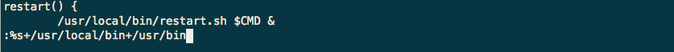

一定要**注意**的是，这里并不是在文件中增加这一行代码，如上图，我们是给vim输入了一串指令，这个指令的作用是批量修改一些代码，当回车后会显示：`7 substitutions on 7 lines`，然后我们输入`:wq!`保存并退出文件的编辑

同样的方式，修改`/etc/init.d/fdfs_trackerd`，输入命令
```
[root@localhost FastDFS]# vi /etc/init.d/fdfs_trackerd

:%s+/usr/local/bin+/usr/bin

:wq!
```

<br/>

### 配置tracker
进入`/etc/fdfs`目录并复制一份`tracker.conf.sample`并命名为`tracker.conf`，并修改`tracker.conf`，将其中的`base_path`参数的值修改为`/fastdfs/tracker`，并使用`makir -p /fastdfs/tracker`创建两个目录

```
[root@localhost FastDFS]# cd /etc/fdfs && ll
[root@localhost fdfs]# cp tracker.conf.sample tracker.conf
[root@localhost fdfs]# vi tracker.conf
```
点击键盘的`i`键进入vim的编辑模式，如果编辑完成后要先点击键盘的`ESC`键退出vim的编辑模式再点击键盘的键`:wq!`直接会在左下角写入

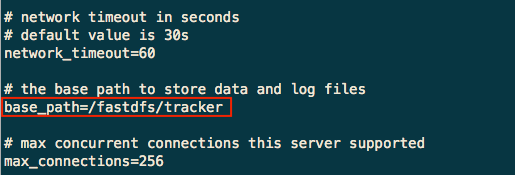

```
:wq!

[root@localhost fdfs]# mkdir -p /fastdfs/tracker 
```

启动tracker：
```
[root@localhost fdfs]# /etc/init.d/fdfs_trackerd start   
```

<br/>

### 配置storage

进入`/etc/fdfs`目录，赋值一份`storage.conf.sample`并命名为`storage.conf`，并修改`storage.conf`

```
[root@localhost fdfs]# cp storage.conf.sample storage.conf
[root@localhost fdfs]# vi storage.conf
```
修改如下几个参数：
```
base_path=/fastdfs/storage
store_path0=/fastdfs/storage
tracker_server=192.168.148.131:22122  #这个IP地址是你服务器的IP，输入命令`ip addr`即可查看到服务器的IP
```
保存退出并创建`/fastdfs/storage`目录
```
:wq!

[root@localhost fdfs]# mkdir /fastdfs/storage
```

启动storage
```
/etc/init.d/fdfs_storaged start
```

查看tracker和storage是否启动成功
```
ps -ef | grep fdfs
```

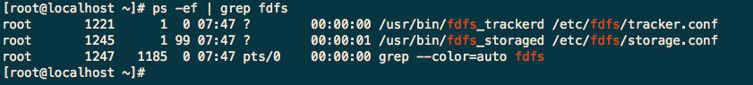

出现如上的显示才证明tracker和storage都正常启动了。
**注意** 这个地方要吐槽一下啦，要是你输入`ps -ef | grep fdfs`出现的不是这三行，而是两行或其他，就证明肯定有一个服务没有启动成功，一般就是你的配置有错误；
那么你有下面两个选择来解决这一错误情况：

> 1、执行`/etc/init.d/fdfs_storaged stop`和`/etc/init.d/fdfs_trackerd stop`关闭服务，然后先启动tracker服务再执行storage服务，一般就可以解决
> 2、如果上面的办法还是不行，就重新安装FastDFS（从新直接编译方法即可）；其次还要重新删除`tracker.conf`和`storage.conf`重新配置；最后再重新启动服务（尽量重启一下服务器）

如上我们就完成了FastDFS的配置。

<br/>

### 测试文件上传

进入`/etc/fdfs`目录并复制一份`client.conf.sample`并命名为`client.conf`

```
[root@localhost fdfs]# cp client.conf.sample client.conf
[root@localhost fdfs]# vi client.conf
```

编辑下列两项内容
```
base_path=/fastdfs/tracker  
tracker_server=192.168.148.131:22122  #这个IP地址是你服务器的IP地址，输入命令`ip addr`即可查看到。不要盲目复制
```

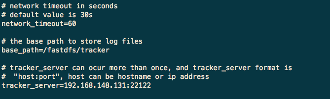

下面使用`fdfs_upload_file`脚本进行文件上传操作。先创建测试文件，输入命令`vi test.txt`，回车后点击`i`键进入编辑模式，输入`Hello TyCoding!`，点击`ESC`键，输入`:wq!`保存并退出，通过
```
[root@localhost ~]# vi test.txt
Hello TyCoding!

/usr/bin/fdfs_upload_file /etc/fdfs/client.conf ~/test.txt
```

如果出现类似下面的返回地址证明上传成功

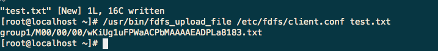

<br/>

### FastDFS与Nginx结合

解压`nginx-1.6.2.tar.gz`到`/usr/local`目录下；解压`fastdfs-nginx-module_v1.16.tar.gz`到`/usr/local`目录下，编译和安装

```
[root@localhost ~]# cd ~/software
[root@localhost software]# tar -zxvf nginx-1.6.2.tar.gz -C /usr/local/ 
[root@localhost software]# tar -zxvf fastdfs-nginx-module_v1.16.tar.gz -C /usr/local/fast/
```

进入`/usr/local/fast/fastdfs-nginx-module/src/`目录下，修改其中的`config`文件，把其中第四行的`usr/local/include`都改为`/usr/include`

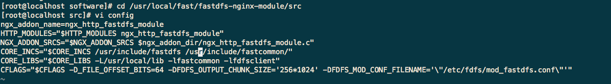

<br/>

#### 编译nginx

```
[root@localhost src]# cd /usr/local/ && ll
[root@localhost local]# cd nginx-1.6.2 && ./configure --prefix=/usr/local/nginx --add-module=../fast/fastdfs-nginx-module/src/
```

正常情况下，会显示如下信息证明编译成功，因为这里需要为nginx添加`fastdfs-nginx-module`模块，和平常安装的nginx是不同的，如果不显示如下页面就重新进行编译

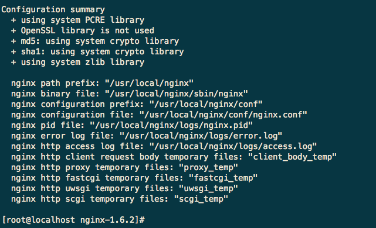

安装，并copy `/usr/local/fast/fastdfs-nginx-module/src/mod_fastdfs.conf` 到`/etc/fdfs`
```
[root@localhost nginx-1.6.2]# make && make install 
[root@localhost nginx-1.6.2]# cd /usr/local/fast/fastdfs-nginx-module/src/
[root@localhost src]# cp /usr/local/fast/fastdfs-nginx-module/src/mod_fastdfs.conf /etc/fdfs/
[root@localhost src]# cd /etc/fdfs && ll
[root@localhost fdfs]# vi mod_fastdfs.conf
```

修改如下部分
```
connect_timeout=10
tracker_server=192.168.148.131:22122  #IP地址还是根据自己的服务器IP地址来定
url_have_group_name = true
store_path0=/fastdfs/storage
```

赋值FastDFS里的2个文件，到`/etc/fdfs`目录中，创建一个软连接，在`/fastdfs/storage`文件储存目录下创建软连接，将其连接到实际存放数据的目录
```
[root@localhost fdfs]# cd /usr/local/fast/FastDFS/conf/ && ll
[root@localhost conf]# cp http.conf mime.types /etc/fdfs/ 
[root@localhost conf]# ln -s /fastdfs/storage/data/ /fastdfs/storage/data/M00
```

修改nginx的配置文件`nginx-conf`
```
[root@localhost conf]# cd /usr/local/nginx/conf && ll
[root@localhost conf]# vi nginx.conf
```

修改如下部分
```
 location ~/group([0-9])/M00 {
   ngx_fastdfs_module;
 }
```

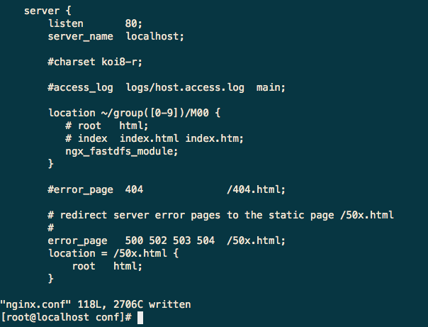

启动nginx
```
[root@localhost conf]# /usr/local/nginx/sbin/nginx
```
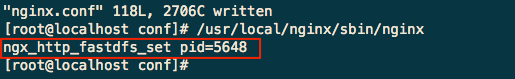

如果出现以上显示证明nginx启动成功，否者的话启动失败，要重新编译安装nginx，一般都是`fastdfs-nginx-module`模块注入到nginx失败。

以上我们已经完成了全部的配置，测试各个端口的启动情况，输入`netstat -ntlp`，可以看到如下信息：

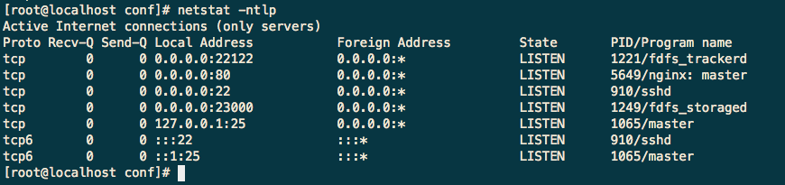

出现上述信息证明各个配置都正常

<br/>

### 通过http的方式访问上传文件

```
[root@localhost conf]# /usr/bin/fdfs_upload_file /etc/fdfs/client.conf ~/test.txt
```

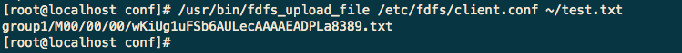

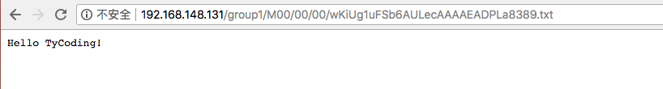

<br/>

### 设置服务开机自启动

经过上面的环境配置，我们一共需要启动三个服务才能实现最终的效果，那么每次启动服务器都手动去启动这些服务未免显得太过于麻烦了，所以我们配置这些服务开机自启动即可：

```
[root@localhost ~]#  vi /etc/rc.d/rc.local
```
向其中添加需要开机自启动服务的脚本
```
/etc/init.d/fdfs_trackerd start
/etc/init.d/fdfs_storaged start
/usr/local/nginx/sbin/nginx
```

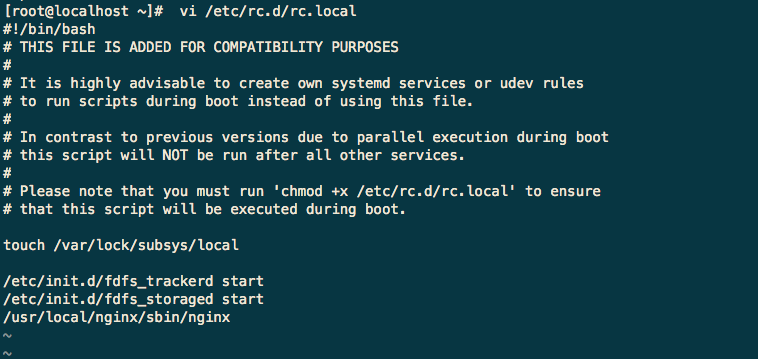

其次，我们还要给`rc.local`文件赋予权限才能实现开机自启动

```
[root@localhost ~]# chmod +x /etc/rc.d/rc.local
```

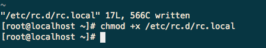

输入命令`reboot`重启服务器，再输入`netstat -ntlp`查看当前启动的服务，可以看到`storage`, `tracker`, `nginx`三个服务都自启动了。

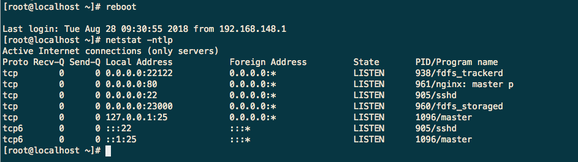


## 注意
> 参考文章：https://qq52o.me/2077.html   
>   我也是根据上述文章中的介绍搭建的系统，但是并没有成功，于是我改变了其中的一些步骤（命令行），参看了网上其他的文章，最终成功搭建！

  * 教程中使用的系统版本是CentOS7
  
  * 如果你在配置tracker和storage完成后启动服务，两个服务并没有都启动，请先执行`xxx stop`的命令关闭服务，然后按照先启动tracker再启动storage的顺序启动服务；如果还是没有启动成功，最好重新安装FastDFS（直接重新执行命令即可），重新配置相关的文件，然后重启服务器，再重启服务，一般就解决了。

  * 如果你在安装nginx时添加`fastdfs-nginx-module`模块时出现`error`，请重新编译nginx，重新配置相关的文件，一般就能解决了。

最后祝愿大家都能成功的搭建FastDFS系统。


<br/>

# 交流

如果大家有兴趣，欢迎大家加入我的Java交流群：671017003 ，一起交流学习Java技术。博主目前一直在自学JAVA中，技术有限，如果可以，会尽力给大家提供一些帮助，或是一些学习方法，当然群里的大佬都会积极给新手答疑的。所以，别犹豫，快来加入我们吧！

<br/>

# 联系

If you have some questions after you see this article, you can contact me or you can find some info by clicking these links.

- [Blog@TyCoding's blog](http://www.tycoding.cn)
- [GitHub@TyCoding](https://github.com/TyCoding)
- [ZhiHu@TyCoding](https://www.zhihu.com/people/tomo-83-82/activities)